<div align="center">

# 🗓️ Schichtplan

### AI-Powered Employee Scheduling System

*Modern workforce management with intelligent automation, passwordless security, and multi-platform deployment*

[](https://github.com/jango-blockchained/schichtplan/actions/workflows/ci.yml)
[](https://github.com/jango-blockchained/schichtplan/actions/workflows/docker-build.yml)
[](https://github.com/jango-blockchained/schichtplan/actions/workflows/electron-build.yml)
[](https://opensource.org/licenses/MIT)
[](https://www.python.org/downloads/)
[](https://www.typescriptlang.org/)

[Features](#-key-features) • [Quick Start](#-quick-start) • [Documentation](https://jango-blockchained.github.io/schichtplan) • [Demo](#-demo) • [Contributing](#-contributing)

</div>

---

## 🎯 What Makes Schichtplan Different?

**Schichtplan** is not just another scheduling tool—it's a next-generation workforce management platform that combines cutting-edge AI technology with enterprise-grade security and multi-platform flexibility.

### 🌟 Unique Selling Points

<table>
<tr>
<td width="33%" valign="top">

**🤖 AI-Powered Scheduling**
- Model Context Protocol (MCP) integration
- Natural language schedule optimization
- Intelligent conflict resolution
- Automated workload balancing
- Integration with Claude, ChatGPT, and more

</td>
<td width="33%" valign="top">

**🔐 Passwordless Security**
- WebAuthn/Passkey authentication
- Biometric login support
- No passwords to remember or breach
- Recovery code backup system
- Daily admin authentication

</td>
<td width="33%" valign="top">

**🚀 Deploy Anywhere**
- Web application (React + Flask)
- Desktop app (Windows, macOS, Linux)
- Docker containers
- Telegram bot integration
- Cloud or self-hosted

</td>
</tr>
</table>

### 💡 Perfect For

- 🏪 Retail stores with complex shift patterns
- 🏥 Healthcare facilities requiring 24/7 coverage
- 🍽️ Restaurants and hospitality businesses
- 🏢 Any organization managing hourly employees

---

## ⚡ Quick Start

Get up and running in minutes:

```bash
# Clone the repository
git clone https://github.com/jango-blockchained/schichtplan.git
cd schichtplan

# Set up Python environment
python -m venv src/backend/.venv
source src/backend/.venv/bin/activate  # On Windows: src\backend\.venv\Scripts\activate
pip install -r requirements.txt

# Install frontend dependencies
cd src/frontend && bun install && cd ../..

# Start everything (backend + frontend + AI)
./start.sh --with-mcp
```

🎉 Open your browser to `http://localhost:5173` and follow the setup wizard!

**First-time setup includes:**
1. 🔑 Create your admin passkey (no password needed!)
2. 💾 Save recovery codes
3. 🤖 Optional: Configure AI integration (Gemini, OpenAI, or Anthropic)

> 📖 **Detailed Setup Guide:** See our [complete setup documentation](docs/SETUP_AND_AUTHENTICATION_GUIDE.md)

---

## ✨ Key Features

### 🎨 Core Scheduling Features

- ✅ **Visual Schedule Builder** - Drag-and-drop interface with real-time validation
- 📊 **Coverage Management** - Define staffing needs by time intervals
- 👥 **Employee Groups** - Support for VZ, TZ, GFB, TL classifications
- 🔄 **Version Control** - Compare and manage multiple schedule versions
- 🗓️ **Split Week Support** - Handle schedules crossing month boundaries
- 📱 **Availability Management** - Hover-to-view employee availability
- ⏰ **Keyholder Management** - Automatic opening/closing shift assignment
- 📄 **PDF Export** - Professional, customizable schedule printouts

### 🤖 AI & Automation

- 🧠 **MCP Server Integration** - Model Context Protocol for AI tools
  - Schedule optimization and conflict resolution
  - Natural language queries about schedules
  - Workload analysis and recommendations
  - Compliance checking
- 💬 **Telegram Bot** - Manage schedules from your phone
  - Natural language commands
  - Employee search and details
  - AI-powered conversations
  - Access control and permissions
- 🔮 **Intelligent Assignment** - Automated shift allocation based on:
  - Employee preferences and availability
  - Coverage requirements
  - Labor law compliance
  - Fairness and workload distribution

### 🔐 Security & Authentication

- 🔒 **WebAuthn/Passkey** - Modern passwordless authentication
  - Biometric login (fingerprint, face recognition)
  - Security key support
  - Device PIN fallback
- 🎫 **Recovery Codes** - 4 backup codes for emergency access
- 🛡️ **Daily Authentication** - Enhanced security with re-authentication
- 👤 **Role-Based Access** - Admin and user permission levels

### 🚀 Deployment & Integration

- 🐳 **Docker Ready** - Complete containerization
  - Separate containers for backend, frontend, MCP
  - Docker Compose for easy orchestration
  - Multi-architecture support (amd64, arm64)
- 💻 **Desktop Apps** - Native Electron builds
  - Windows NSIS installer
  - macOS DMG
  - Linux AppImage, DEB, RPM
- ☁️ **Cloud or Self-Hosted** - Your choice of deployment
- 📡 **REST API** - Comprehensive API for integrations
- 🤝 **CI/CD Pipeline** - Automated testing and deployment

### 📈 Monitoring & Diagnostics

- 📝 **Comprehensive Logging** - Structured logging system
  - Application logs
  - Scheduler-specific logs
  - Error tracking
  - User action audit trail
- 🔍 **Diagnostic Tools** - Built-in debugging utilities
- 📊 **Performance Monitoring** - Track system health

---

## 🏗️ Architecture

```mermaid
graph TB
    subgraph "Frontend Layer"
        A[React/TypeScript SPA]
        B[Electron Desktop App]
        C[Telegram Bot]
    end
    
    subgraph "Backend Layer"
        D[Flask REST API]
        E[MCP Server]
        F[AI Integration]
    end
    
    subgraph "Data Layer"
        G[(SQLite Database)]
        H[Migrations/Alembic]
    end
    
    A --> D
    B --> D
    C --> D
    D --> G
    E --> F
    E --> D
    D --> H
    H --> G
    
    style A fill:#61dafb
    style D fill:#000000
    style E fill:#ff6b6b
    style G fill:#003b57
```

<div align="center">



</div>

### Tech Stack

| Layer | Technologies |
|-------|-------------|
| **Frontend** | React 18, TypeScript, Vite, Shadcn UI, TanStack Query, React Hook Form |
| **Backend** | Python 3.12+, Flask, SQLAlchemy, Alembic, FastMCP |
| **Database** | SQLite (PostgreSQL compatible) |
| **AI/ML** | Model Context Protocol, OpenAI, Anthropic Claude, Google Gemini |
| **Desktop** | Electron, electron-builder |
| **DevOps** | Docker, Docker Compose, GitHub Actions, pytest, Bun |
| **Authentication** | WebAuthn (py-webauthn), JWT |

---

## 🌍 Platform Support

| Platform | Status | Download |
|----------|--------|----------|
| 🌐 **Web** | ✅ Production Ready | Clone and deploy |
| 🐳 **Docker** | ✅ Production Ready | `docker pull ghcr.io/jango-blockchained/schichtplan` |
| 🪟 **Windows** | ✅ Production Ready | [Releases](https://github.com/jango-blockchained/schichtplan/releases) |
| 🍎 **macOS** | ✅ Production Ready | [Releases](https://github.com/jango-blockchained/schichtplan/releases) |
| 🐧 **Linux** | ✅ Production Ready | AppImage, DEB, RPM |
| 📱 **Telegram** | ✅ Production Ready | Configure your bot |

---

## 🎓 Documentation

<table>
<tr>
<td width="50%">

### 📚 User Guides
- [Setup & Authentication](docs/SETUP_AND_AUTHENTICATION_GUIDE.md)
- [Telegram Bot Setup](docs/TELEGRAM_BOT_GUIDE.md)
- [Vacation Planning](docs/VACATION_PLANNING_QUICK_START.md)
- [CI/CD Quick Reference](docs/CI_CD_QUICK_REFERENCE.md)

</td>
<td width="50%">

### 🔧 Developer Guides
- [CI/CD Architecture](docs/CI_CD_ARCHITECTURE.md)
- [AI Integration Guide](docs/AI_OPTIMIZATION_GUIDE.md)
- [Testing Guide](TESTING_GUIDE.md)
- [Wiring Documentation](docs/APP_WIRING_DOCUMENTATION.md)

</td>
</tr>
</table>

📖 **Full Documentation Site:** [https://jango-blockchained.github.io/schichtplan](https://jango-blockchained.github.io/schichtplan)

---

## 🛠️ Advanced Usage

### Docker Deployment

```bash
# Using Docker Compose
docker-compose up -d

# Or build and run individual containers
docker build -f Dockerfile.backend -t schichtplan-backend .
docker build -f Dockerfile -t schichtplan-frontend .
docker run -p 5000:5000 schichtplan-backend
docker run -p 80:80 schichtplan-frontend
```

### Telegram Bot Setup

```bash
# 1. Get your bot token from @BotFather
# 2. Configure environment
export TELEGRAM_BOT_TOKEN="your-token-here"
export ENABLE_TELEGRAM_BOT=true
export TELEGRAM_BOT_MODE=polling

# 3. Start the bot
python start_telegram_bot.py
```

### MCP Integration

```bash
# Start with MCP for AI integration
./start.sh --with-mcp

# Configure in Claude Desktop or other MCP clients
# Add to your MCP settings:
{
  "schichtplan": {
    "command": "python",
    "args": ["src/backend/mcp_server.py", "--transport", "stdio"],
    "env": {}
  }
}
```

### Desktop App Development

```bash
# Build for all platforms
npm run electron:build

# Platform-specific builds
npm run electron:build:mac
npm run electron:build:win
npm run electron:build:linux

# Development mode
npm run electron:dev
```

---

## 🧪 Development & Testing

### Running Tests

```bash
# Run all tests
npm test

# Backend tests with coverage
pytest -v --cov=src/backend tests/

# Frontend tests
cd src/frontend && bun test

# Specific test suites
pytest tests/backend/scheduler/  # Scheduler tests only
```

### Code Quality

```bash
# Lint and format all code
npm run format
npm run lint

# Check everything (lint + typecheck)
npm run check:all

# Backend only
npm run lint:backend
npm run format:backend

# Frontend only  
cd src/frontend && bun run lint
cd src/frontend && bun run format
```

### Database Migrations

```bash
# Apply pending migrations
flask db upgrade

# Create new migration
flask db migrate -m "Description of changes"

# Check current migration status
flask db current
```

---

## 📊 Project Stats

- 📝 **~92,000 lines of code**
- 🧪 **Comprehensive test coverage**
- 🐍 **Python 3.12+**
- ⚛️ **React 18 + TypeScript 5**
- 🔧 **Actively maintained**

---

## 🤝 Contributing

We welcome contributions! Here's how to get started:

1. 🍴 Fork the repository
2. 🌿 Create a feature branch (`git checkout -b feature/amazing-feature`)
3. ✍️ Write clean, documented code
4. ✅ Add/update tests
5. 🎨 Follow code style guidelines (use `npm run format`)
6. 🔍 Run tests and linting (`npm run check:all`)
7. 📝 Commit your changes (`git commit -m 'Add amazing feature'`)
8. 🚀 Push to the branch (`git push origin feature/amazing-feature`)
9. 🎉 Open a Pull Request

### Development Guidelines

- **Python**: Follow PEP8, use type hints, add docstrings
- **TypeScript**: Use strict mode, proper typing, ESLint rules
- **Testing**: Maintain test coverage for new features
- **Documentation**: Update docs for user-facing changes
- **Commits**: Use clear, descriptive commit messages

See [CONTRIBUTING.md](CONTRIBUTING.md) for detailed guidelines.

---

## 📜 License

This project is licensed under the **MIT License** - see the [LICENSE](LICENSE) file for details.

---

## 🙏 Acknowledgments

Built with ❤️ using:
- [React](https://react.dev/) - UI framework
- [Flask](https://flask.palletsprojects.com/) - Backend framework
- [FastMCP](https://github.com/jlowin/fastmcp) - Model Context Protocol
- [Shadcn UI](https://ui.shadcn.com/) - Component library
- [Electron](https://www.electronjs.org/) - Desktop framework
- [python-telegram-bot](https://python-telegram-bot.org/) - Telegram integration

Special thanks to all [contributors](https://github.com/jango-blockchained/schichtplan/graphs/contributors) who have helped build Schichtplan!

---

## 🔗 Links

- 📖 [Documentation](https://jango-blockchained.github.io/schichtplan)
- 🐛 [Issue Tracker](https://github.com/jango-blockchained/schichtplan/issues)
- 💬 [Discussions](https://github.com/jango-blockchained/schichtplan/discussions)
- 📦 [Releases](https://github.com/jango-blockchained/schichtplan/releases)
- 🐳 [Docker Images](https://github.com/orgs/jango-blockchained/packages?repo_name=schichtplan)

---

## 📞 Support

Need help? Here's how to get support:

1. 📚 Check the [Documentation](https://jango-blockchained.github.io/schichtplan)
2. 🔍 Search [existing issues](https://github.com/jango-blockchained/schichtplan/issues)
3. 💬 Start a [discussion](https://github.com/jango-blockchained/schichtplan/discussions)
4. 🐛 [Report a bug](https://github.com/jango-blockchained/schichtplan/issues/new)

---

<div align="center">

**⭐ Star us on GitHub — it motivates us a lot!**

Made with ☕ and 💻 by the Schichtplan Team

[⬆ Back to Top](#-schichtplan)

</div>
