# Docker Deployment

Deploy Schichtplan using Docker containers for a clean, isolated, and scalable installation.

## Quick Start

The fastest way to get Schichtplan running with Docker:

```bash
# Clone the repository
git clone https://github.com/jango-blockchained/schichtplan.git
cd schichtplan

# Start all services
docker-compose up -d
```

That's it! Access Schichtplan at http://localhost

## Architecture

Schichtplan uses a multi-container architecture:

```mermaid
graph LR
    A[nginx<br/>Reverse Proxy] --> B[Frontend<br/>React App]
    A --> C[Backend<br/>Flask API]
    A --> D[MCP Server<br/>AI Integration]
    C --> E[(SQLite<br/>Database)]
    
    style A fill:#2196F3
    style B fill:#61dafb
    style C fill:#000000
    style D fill:#FF6B6B
    style E fill:#003B57
```



### Containers

| Container | Purpose | Port |
|-----------|---------|------|
| **nginx** | Reverse proxy and static file serving | 80, 443 |
| **frontend** | React application (production build) | Internal |
| **backend** | Flask REST API | 5000 |
| **mcp** | Model Context Protocol server | 8001 |

## Prerequisites

- Docker 20.10 or higher
- Docker Compose 2.0 or higher
- 2GB RAM minimum (4GB recommended)
- 10GB disk space

## Installation

### 1. Clone Repository

```bash
git clone https://github.com/jango-blockchained/schichtplan.git
cd schichtplan
```

### 2. Configure Environment

Create a `.env` file for production settings:

```bash
cp .env.prod.example .env
```

Edit `.env` with your configuration:

```bash
# Application
SECRET_KEY=your-secret-key-here-change-this
FLASK_ENV=production

# WebAuthn (use your domain)
WEBAUTHN_RP_ID=yourdomain.com
WEBAUTHN_RP_NAME=Schichtplan
WEBAUTHN_ORIGIN=https://yourdomain.com

# AI Integration (optional)
GEMINI_API_KEY=your-gemini-key
OPENAI_API_KEY=your-openai-key
ANTHROPIC_API_KEY=your-anthropic-key

# Telegram Bot (optional)
TELEGRAM_BOT_TOKEN=your-bot-token
ENABLE_TELEGRAM_BOT=true
TELEGRAM_BOT_MODE=webhook
TELEGRAM_BOT_WEBHOOK_URL=https://yourdomain.com/api/telegram/webhook
```

!!! warning "Security"
    Always change `SECRET_KEY` in production! Generate a secure key:
    ```bash
    python -c "import secrets; print(secrets.token_hex(32))"
    ```

### 3. Build Images

Build all Docker images:

```bash
docker-compose build
```

Or build specific services:

```bash
docker-compose build backend
docker-compose build frontend
docker-compose build mcp
```

### 4. Start Services

Start all containers:

```bash
docker-compose up -d
```

Check status:

```bash
docker-compose ps
```

View logs:

```bash
# All services
docker-compose logs -f

# Specific service
docker-compose logs -f backend
```

## Configuration

### Docker Compose

The `docker-compose.yml` file defines the services:

```yaml
version: '3.8'

services:
  backend:
    build:
      context: .
      dockerfile: Dockerfile.backend
    ports:
      - "5000:5000"
    environment:
      - FLASK_ENV=production
    volumes:
      - ./instance:/app/instance
    restart: unless-stopped

  frontend:
    build:
      context: .
      dockerfile: Dockerfile
    ports:
      - "80:80"
    depends_on:
      - backend
    restart: unless-stopped

  mcp:
    build:
      context: .
      dockerfile: Dockerfile.mcp
    ports:
      - "8001:8001"
    depends_on:
      - backend
    restart: unless-stopped
```

### Custom Configuration

Create `docker-compose.override.yml` for local customizations:

```yaml
version: '3.8'

services:
  backend:
    environment:
      - DEBUG=true
      - LOG_LEVEL=DEBUG
    volumes:
      - ./custom-data:/app/data

  frontend:
    ports:
      - "8080:80"  # Use different port
```

## Volumes & Persistence

### Database Storage

The SQLite database is stored in a volume:

```yaml
volumes:
  - ./instance:/app/instance
```

This ensures your data persists across container restarts.

### Backup

Backup your data regularly:

```bash
# Create backup directory
mkdir -p backups

# Backup database
docker-compose exec backend cp /app/instance/app.db /app/instance/app.db.backup
docker cp schichtplan_backend_1:/app/instance/app.db ./backups/app.db.$(date +%Y%m%d)
```

### Restore

Restore from backup:

```bash
# Stop containers
docker-compose down

# Restore database
cp ./backups/app.db.20240101 ./instance/app.db

# Start containers
docker-compose up -d
```

## Updates

### Update to Latest Version

```bash
# Pull latest code
git pull

# Rebuild images
docker-compose build

# Restart services
docker-compose down
docker-compose up -d
```

### Zero-Downtime Updates

For production, use rolling updates:

```bash
# Update backend
docker-compose up -d --no-deps --build backend

# Update frontend
docker-compose up -d --no-deps --build frontend

# Update MCP
docker-compose up -d --no-deps --build mcp
```

## SSL/TLS Configuration

### Using nginx

Configure nginx for HTTPS:

```nginx
server {
    listen 443 ssl http2;
    server_name yourdomain.com;

    ssl_certificate /etc/nginx/ssl/cert.pem;
    ssl_certificate_key /etc/nginx/ssl/key.pem;

    location / {
        proxy_pass http://frontend;
        proxy_set_header Host $host;
        proxy_set_header X-Real-IP $remote_addr;
        proxy_set_header X-Forwarded-For $proxy_add_x_forwarded_for;
        proxy_set_header X-Forwarded-Proto $scheme;
    }

    location /api {
        proxy_pass http://backend:5000;
        proxy_set_header Host $host;
        proxy_set_header X-Real-IP $remote_addr;
    }
}

server {
    listen 80;
    server_name yourdomain.com;
    return 301 https://$host$request_uri;
}
```

### Using Let's Encrypt

Add Certbot container:

```yaml
certbot:
  image: certbot/certbot
  volumes:
    - ./certbot/conf:/etc/letsencrypt
    - ./certbot/www:/var/www/certbot
  command: certonly --webroot -w /var/www/certbot --email admin@yourdomain.com --agree-tos --no-eff-email -d yourdomain.com
```

## Monitoring

### Health Checks

Docker Compose includes health checks:

```yaml
backend:
  healthcheck:
    test: ["CMD", "curl", "-f", "http://localhost:5000/health"]
    interval: 30s
    timeout: 10s
    retries: 3
```

Check health:

```bash
docker-compose ps
```

### Logs

View logs for debugging:

```bash
# All services
docker-compose logs -f

# Last 100 lines
docker-compose logs --tail=100

# Specific service
docker-compose logs -f backend

# With timestamps
docker-compose logs -f -t
```

### Resource Usage

Monitor container resources:

```bash
docker stats
```

## Scaling

### Horizontal Scaling

Scale backend instances:

```bash
docker-compose up -d --scale backend=3
```

Add load balancer in `docker-compose.yml`:

```yaml
nginx:
  image: nginx:alpine
  ports:
    - "80:80"
  volumes:
    - ./nginx/nginx.conf:/etc/nginx/nginx.conf
  depends_on:
    - backend
```

Configure nginx for load balancing:

```nginx
upstream backend {
    server backend_1:5000;
    server backend_2:5000;
    server backend_3:5000;
}

server {
    location /api {
        proxy_pass http://backend;
    }
}
```

## Troubleshooting

### Common Issues

??? question "Containers won't start"
    
    Check logs for errors:
    ```bash
    docker-compose logs backend
    ```
    
    Verify environment variables:
    ```bash
    docker-compose config
    ```

??? question "Port conflicts"
    
    Change ports in `docker-compose.override.yml`:
    ```yaml
    services:
      frontend:
        ports:
          - "8080:80"
    ```

??? question "Database locked"
    
    SQLite doesn't support concurrent writes well. Consider PostgreSQL for heavy use:
    
    ```yaml
    postgres:
      image: postgres:15
      environment:
        POSTGRES_DB: schichtplan
        POSTGRES_USER: schichtplan
        POSTGRES_PASSWORD: secure_password
      volumes:
        - postgres_data:/var/lib/postgresql/data
    ```

??? question "Out of memory"
    
    Increase Docker memory limit or add swap:
    ```bash
    docker-compose down
    docker system prune -a
    docker-compose up -d
    ```

### Debug Mode

Run in development mode for debugging:

```bash
# Stop production containers
docker-compose down

# Run in dev mode with live reload
docker-compose -f docker-compose.yml -f docker-compose.dev.yml up
```

## Best Practices

### Security

- ✅ Always use HTTPS in production
- ✅ Change default `SECRET_KEY`
- ✅ Restrict database file permissions
- ✅ Use environment variables for secrets
- ✅ Keep Docker images updated
- ✅ Enable firewall rules
- ✅ Regular security audits

### Performance

- ✅ Use nginx for static file caching
- ✅ Enable gzip compression
- ✅ Configure proper resource limits
- ✅ Use production build of frontend
- ✅ Monitor resource usage
- ✅ Regular backups

### Maintenance

- ✅ Schedule regular backups
- ✅ Monitor disk space
- ✅ Review logs periodically
- ✅ Keep images updated
- ✅ Test updates in staging first
- ✅ Document custom configurations

## Production Checklist

Before going live:

- [ ] Change `SECRET_KEY` to a secure random value
- [ ] Configure proper domain and SSL/TLS certificates
- [ ] Set up automated backups
- [ ] Configure monitoring and alerting
- [ ] Test WebAuthn with your domain
- [ ] Review and restrict access control
- [ ] Set up log rotation
- [ ] Configure firewall rules
- [ ] Test disaster recovery procedure
- [ ] Document your setup

## Alternative: Pre-built Images

Use pre-built images from GitHub Container Registry:

```yaml
services:
  backend:
    image: ghcr.io/jango-blockchained/schichtplan-backend:latest
    
  frontend:
    image: ghcr.io/jango-blockchained/schichtplan-frontend:latest
    
  mcp:
    image: ghcr.io/jango-blockchained/schichtplan-mcp:latest
```

This is faster but less customizable.

## Need Help?

- 📖 [Docker Documentation](https://docs.docker.com/)
- 💬 [GitHub Discussions](https://github.com/jango-blockchained/schichtplan/discussions)
- 🐛 [Report an Issue](https://github.com/jango-blockchained/schichtplan/issues)
- 🔧 [Troubleshooting Guide](../guides/troubleshooting.md)

---

**Next:** [Desktop Apps](desktop.md) or [Cloud Deployment](cloud.md)
