# Schedule Generation Process - Simplified Flowchart

```mermaid
flowchart TD
    A[Start Schedule Generation] --> B[Initialize & Load Resources]
    B --> C[Validate Input Parameters]
    C --> D[Process Date Range Loop]
    
    D --> E{For Each Date}
    E --> F[Check Store Operating Hours]
    F --> G{Store Open?}
    G -->|No| H[Skip Date]
    G -->|Yes| I[Get Coverage Requirements]
    
    I --> J[Create Daily Shift Instances]
    J --> K[Get Available Employees]
    K --> L[Apply Constraints & Filters]
    
    L --> M[Employee Assignment Phase]
    M --> N[Check Employee Constraints]
    N --> O{TZ/GFB Employee?}
    O -->|Yes| P[Check Hours/Shift Limits]
    O -->|No| Q[Check Basic Availability]
    
    P --> Q
    Q --> R{Can Assign?}
    R -->|Yes| S[Assign Employee to Shift]
    R -->|No| T[Try Next Employee]
    
    S --> U{Coverage Met?}
    T --> U
    U -->|No| V{More Employees?}
    V -->|Yes| T
    V -->|No| W[Log Coverage Issue]
    U -->|Yes| X[Complete Daily Assignment]
    
    W --> X
    X --> Y{More Dates?}
    Y -->|Yes| E
    Y -->|No| Z[Validation Phase]
    
    H --> Y
    
    Z --> AA[Check Constraint Violations]
    AA --> BB[Verify Keyholder Coverage]
    BB --> CC[Validate Employee Hours]
    CC --> DD[Check Rest Periods]
    
    DD --> EE[Optimization Phase]
    EE --> FF[Apply Soft Constraints]
    FF --> GG[Balance Workload]
    GG --> HH[Optimize Preferences]
    
    HH --> II[Serialization Phase]
    II --> JJ[Convert to Database Format]
    JJ --> KK[Save to Database]
    KK --> LL[Update Version Meta]
    
    LL --> MM[Generate Final Report]
    MM --> NN[End]

    %% Styling
    classDef startEnd fill:#e1f5fe
    classDef process fill:#f3e5f5
    classDef decision fill:#fff3e0
    classDef assignment fill:#e8f5e8
    classDef validation fill:#fce4ec
    classDef optimization fill:#f1f8e9
    
    class A,NN startEnd
    class B,C,I,J,K,L,S,X,II,JJ,KK,LL,MM process
    class G,O,R,U,V,Y decision
    class M,N,P,Q,T,H assignment
    class Z,AA,BB,CC,DD validation
    class EE,FF,GG,HH optimization
```

## Key Phases

1. **Initialization**: Load resources (employees, shifts, coverage requirements)
2. **Date Loop**: Process each date in the range sequentially  
3. **Daily Processing**:
   - Check store hours
   - Get coverage requirements
   - Create shift instances
   - Apply employee constraints
4. **Assignment**: Iteratively assign employees to shifts based on availability and constraints
5. **Validation**: Check constraint violations and coverage requirements
6. **Optimization**: Apply soft constraints and preferences
7. **Finalization**: Save to database and generate reports

## Main Iterations

- **Date Range Loop**: Processes each date from start to end
- **Coverage Block Loop**: For each date, processes all coverage requirements  
- **Employee Assignment Loop**: For each coverage block, tries to assign eligible employees
- **Constraint Checking Loop**: Validates each potential assignment against multiple constraints

## Constraint Types

- **Hard Constraints**: Must be satisfied (availability, absences, rest periods)
- **Soft Constraints**: Preferred but flexible (preferences, workload balance)
- **Employee Group Constraints**: Special rules for TZ/GFB employees (hour limits)
