# Component Refactoring Plan: Shifts and Schedule

## Current Structure Issues

After reviewing the code in the `/src/frontend/src/components/shifts` and `/src/frontend/src/components/schedule` folders, I've identified several issues with the current organization:

1. **Duplicate Components**: There are multiple versions of similar components across both folders:
   - Two `ShiftTable` components with overlapping functionality
   - Two `ShiftCoverageView` components with similar visualization logic
   - Two `ShiftForm` components with similar form handling

2. **Inconsistent Component Organization**:
   - Some components are directly in the folder root while others are in subfolders
   - The `shifts` folder has a `components` subfolder that contains components that should be at the root level
   - The `schedule` folder has a mix of components at the root and in subfolders (`views`, `shifts`, `shared`)

3. **Utility Duplication**:
   - Time calculation utilities are duplicated across both folders
   - Similar helper functions for formatting, parsing, and calculating shift times

4. **Type Inconsistencies**:
   - Different type definitions for similar concepts
   - Some components use types from the main `types/index.ts` while others define their own

## Proposed Component Organization

I propose the following reorganization to address these issues:

```mermaid
graph TD
    A[src/frontend/src/components] --> B[shifts]
    A --> C[schedule]
    
    B --> D[core]
    B --> E[editor]
    B --> F[views]
    B --> G[utils]
    
    C --> H[core]
    C --> I[views]
    C --> J[shared]
    
    D --> D1[ShiftForm.tsx]
    D --> D2[ShiftTable.tsx]
    D --> D3[ShiftTypesEditor.tsx]
    
    E --> E1[ShiftEditor.tsx]
    E --> E2[ShiftEditModal.tsx]
    
    F --> F1[ShiftCoverageView.tsx]
    
    G --> G1[timeCalculator.ts]
    G --> G2[index.ts]
    
    H --> H1[ScheduleTable.tsx]
    H --> H2[ScheduleManager.tsx]
    H --> H3[ScheduleControls.tsx]
    
    I --> I1[CalendarView.tsx]
    I --> I2[DailyView.tsx]
    I --> I3[EmployeeView.tsx]
    I --> I4[MonthlyView.tsx]
    I --> I5[TimeGridView.tsx]
    
    J --> J1[utils.ts]
    J --> J2[ColorPicker.tsx]
    J --> J3[DateRangePicker.tsx]
    J --> J4[EmployeeSelect.tsx]
```

## Detailed Refactoring Plan

### 1. Consolidate Duplicate Components

#### ShiftTable Component
- Create a unified `ShiftTable` component in `shifts/core/ShiftTable.tsx`
- Merge functionality from both existing implementations
- Ensure it handles both weekly schedule display and shift template display
- Use proper TypeScript interfaces for props

#### ShiftCoverageView Component
- Consolidate into a single component in `shifts/views/ShiftCoverageView.tsx`
- Merge visualization logic from both implementations
- Ensure it works with both schedule and shift template data

#### ShiftForm Component
- Create a unified form component in `shifts/core/ShiftForm.tsx`
- Support both shift template editing and schedule shift editing
- Use conditional rendering for context-specific fields

### 2. Consolidate Utility Functions

- Move all time calculation utilities to `shifts/utils/timeCalculator.ts`
- Create a shared utility module that can be used by both shifts and schedule components
- Standardize time parsing, formatting, and calculation functions

### 3. Standardize Type Definitions

- Use types from the main `types/index.ts` where possible
- Create extension types in component-specific files only when necessary
- Ensure consistent naming and structure across all components

### 4. Reorganize Component Hierarchy

- Move components to appropriate folders based on their functionality
- Ensure clear separation between core components, views, and utilities
- Update import paths throughout the codebase

### 5. Update Export Patterns

- Update index.ts files to export components from their new locations
- Maintain backward compatibility by re-exporting from the original locations
- Document the new component structure for future development

## Implementation Steps

1. **Create New Folder Structure**: Set up the new directory structure without moving files yet
2. **Consolidate Utilities**: Merge utility functions first to establish a foundation
3. **Create Unified Components**: Implement the consolidated components in their new locations
4. **Update References**: Update import paths throughout the codebase
5. **Remove Duplicates**: Remove the original duplicate components once the new ones are working
6. **Update Exports**: Update index.ts files to maintain the public API
7. **Test Thoroughly**: Ensure all functionality works as expected after the refactoring

## Specific Component Consolidation Details

### ShiftTable Consolidation

The consolidated ShiftTable should:
- Support both weekly schedule display and shift template display
- Handle drag-and-drop functionality for rearranging shifts
- Support break notes editing
- Provide proper validation for shift rules
- Use consistent styling and UI components

### ShiftCoverageView Consolidation

The consolidated ShiftCoverageView should:
- Visualize shifts across days of the week
- Show keyholder times before and after store hours
- Support both shift templates and actual schedules
- Provide consistent styling and interactive elements

### ShiftForm Consolidation

The consolidated ShiftForm should:
- Support editing of both shift templates and schedule shifts
- Handle all form fields from both current implementations
- Provide proper validation
- Support shift type selection
- Visualize the shift duration and position

## Component Comparison

### ShiftTable Components

| Feature | shifts/components/ShiftTable.tsx | schedule/shifts/ShiftTable.tsx |
|---------|----------------------------------|--------------------------------|
| Drag & Drop | Yes | Yes |
| Break Notes Editing | Yes | Yes |
| Shift Type Display | Yes | Yes |
| Validation | Yes | Limited |
| Styling | Card-based | Table-based |
| Weekly Hours Calculation | Yes | Yes |

### ShiftCoverageView Components

| Feature | shifts/components/ShiftCoverageView.tsx | schedule/views/ShiftCoverageView.tsx |
|---------|----------------------------------------|-------------------------------------|
| Day Visualization | Yes | Yes |
| Keyholder Times | Yes | Yes |
| Timeline | Yes | Yes |
| Interactive Elements | Yes | Yes |
| Styling | Detailed | Simplified |

### ShiftForm Components

| Feature | shifts/ShiftForm.tsx | shifts/components/ShiftForm.tsx |
|---------|---------------------|--------------------------------|
| Time Selection | DateTimePicker | Input type="time" |
| Active Days | Yes | Yes |
| Shift Type | No | Yes |
| Visualization | Yes | Yes |
| Break Settings | Yes | Yes |

## Benefits of Refactoring

1. **Reduced Code Duplication**: Eliminates redundant components and utilities
2. **Improved Maintainability**: Clearer component organization and responsibilities
3. **Better Type Safety**: Consistent type usage across components
4. **Enhanced Developer Experience**: Easier to find and understand components
5. **Future-Proofing**: Better structure for adding new features

## Risks and Mitigations

| Risk | Mitigation |
|------|------------|
| Breaking existing functionality | Thorough testing after each step |
| Import path changes causing errors | Update paths systematically with search/replace |
| Component API changes | Maintain backward compatibility where possible |
| Regression in UI | Visual testing of all components after refactoring |